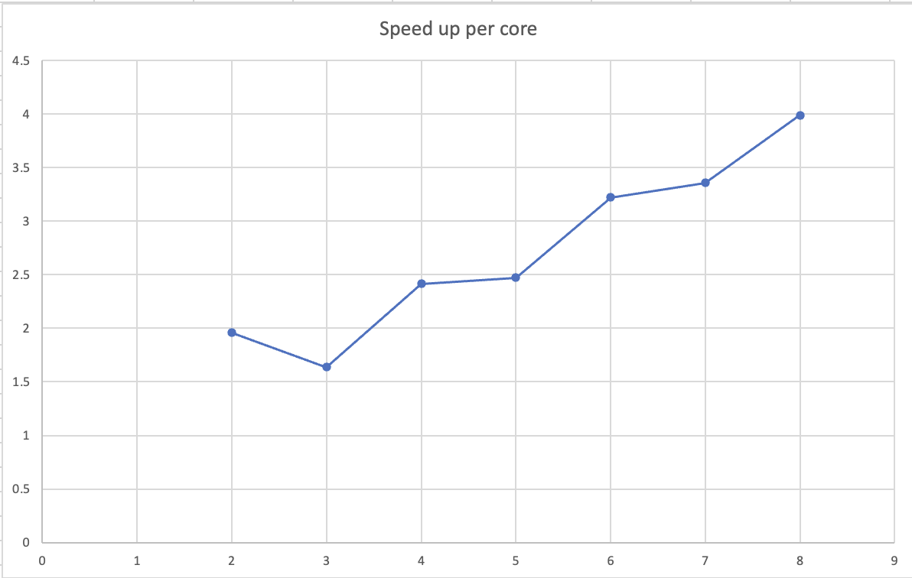

# Writeup for Assignment 1

Xavier Gonzalez: xavier18@stanford.edu
JS Paul: jspaul@stanford.edu

## Program 1

## 1.2

The speed-up is not linear n the number of threads used because of a thread-imbalance (just looking at the mandelbrot image, you can see that more work is being done by the threads in the middle).

## 1.3

The measurements show that because of worker imbalance, we are not getting linear speed ups, but they are instead plateauing.

## 1.4

We chunk the image into smaller pieces, assign each thread to the smaller piece, in this way avoiding worker imbalance. 7.19 thread-up with 8 threads.

## 1.5

Only 7.08 speed up with 16 threads. This is because the specs only support 8 hardware threads, so the OS is context switching between threads.

## Program 2

2, 
Results matched with answer!
****************** Printing Vector Unit Statistics *******************
Vector Width:              2
Total Vector Instructions: 162515
Vector Utilization:        79.8%
Utilized Vector Lanes:     259245
Total Vector Lanes:        325030
************************ Result Verification *************************
4
Results matched with answer!
****************** Printing Vector Unit Statistics *******************
Vector Width:              4
Total Vector Instructions: 94571
Vector Utilization:        72.1%
Utilized Vector Lanes:     272563
Total Vector Lanes:        378284
************************ Result Verification *************************
Passed!!!
8
Results matched with answer!
****************** Printing Vector Unit Statistics *******************
Vector Width:              8
Total Vector Instructions: 51627
Vector Utilization:        68.1%
Utilized Vector Lanes:     281255
Total Vector Lanes:        413016
************************ Result Verification *************************
Passed!!!
16
****************** Printing Vector Unit Statistics *******************
Vector Width:              16
Total Vector Instructions: 26967
Vector Utilization:        66.3%
Utilized Vector Lanes:     285887
Total Vector Lanes:        431472
************************ Result Verification *************************
Passed!!!

We see that utilization goes down as vector width increases. This is likely due to the fact that as vector width increses, there is probably exponent that is much larger than the rest, leading to the other lanes not doing useful computation more often.

## Program 3

## Program 4

## Program 5

## Program 6
